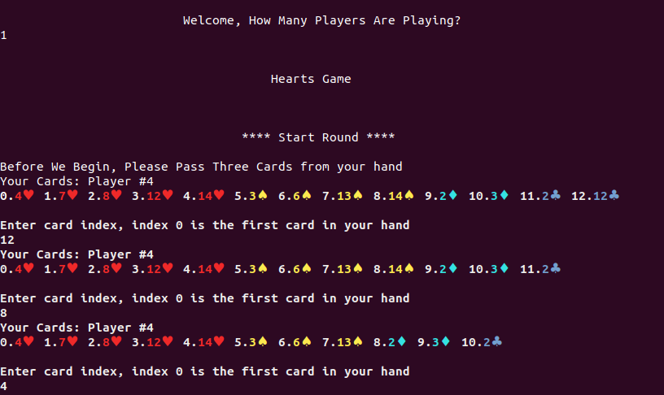
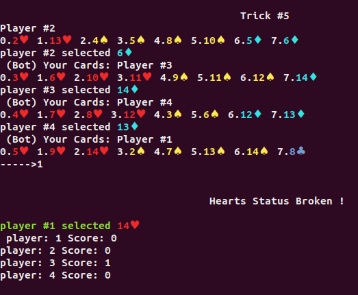

# hearts-game-C

## Overview:

Hearts Game programmed using C language.

A version of this classic Hearts Game was made by me. Please see rules at Rules section below.   

## Structure:     

card.c - create / destroy card struct. Each Card has a suit type and rank number. Suits and Ranks are specified in CardSpecs.h 
deck.c - A deck struct containing array of Cards 
player.c - Create / Destroy a player. Each player has n amount of cards. in this game, each player will have 13 cards. A full deck is 52. 
game.c - Game struct contains all players and scores. Has access to deck.c and player.c 
round.c - Create/ Destroy a Trick. all trick operations are performed in this module. Score are sent back to game.c  

## Input Directions:  

In order to run the game, please use the makefile. 
One must enter a valid number of players. the number entered will be the number of real players. the rest of the players will play as bots. 
Maximum # of players: 4 (no bots), 
Minimum # of players: 0 (4 bots playing against each other). 

## Rules of the Game:  

Hearts is a trick taking game that requires 4 players and a standard 52 playing card deck with Aces high and 2’s low. 
The objective of the game is to have the fewest points when someone reaches 100 points. 

Each turn starts with one player playing a single card, also called leading. 
The suit of that card determines the suit of the trick. The other players then play one card each. 
If they have a card in the same suit as the first card then they must play that. 
If they don't then they can play one of their other cards. Once four cards have been played, 
the player who played the highest ranking card in the original suit takes the trick, 
i.e. he takes the four cards on the table and he then starts the next turn. 
Any penalty cards in the trick (hearts or queen of spades) are added to the players penalty score. 
So you want to avoid taking any tricks that have hearts or the queen of spades. 

You cannot lead a trick with hearts, until hearts has been broken (played on another suit). 
So if it is your turn to lead and no heart has been played yet then you may not select a heart as the card to play first. 
In some variations of the game you can't play the queen of spades until hearts has been broken as well, 
but in this version you can always play the queen of spades and she doesn't break hearts. 

Rules taken from: https://cardgames.io/hearts/#about 
